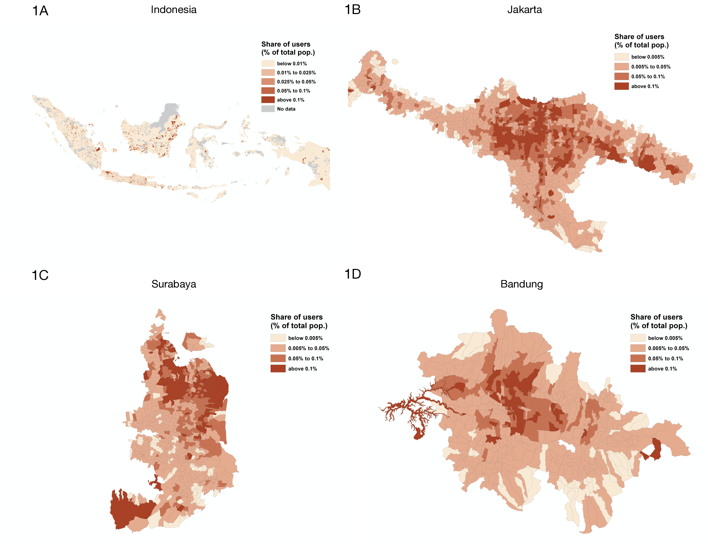
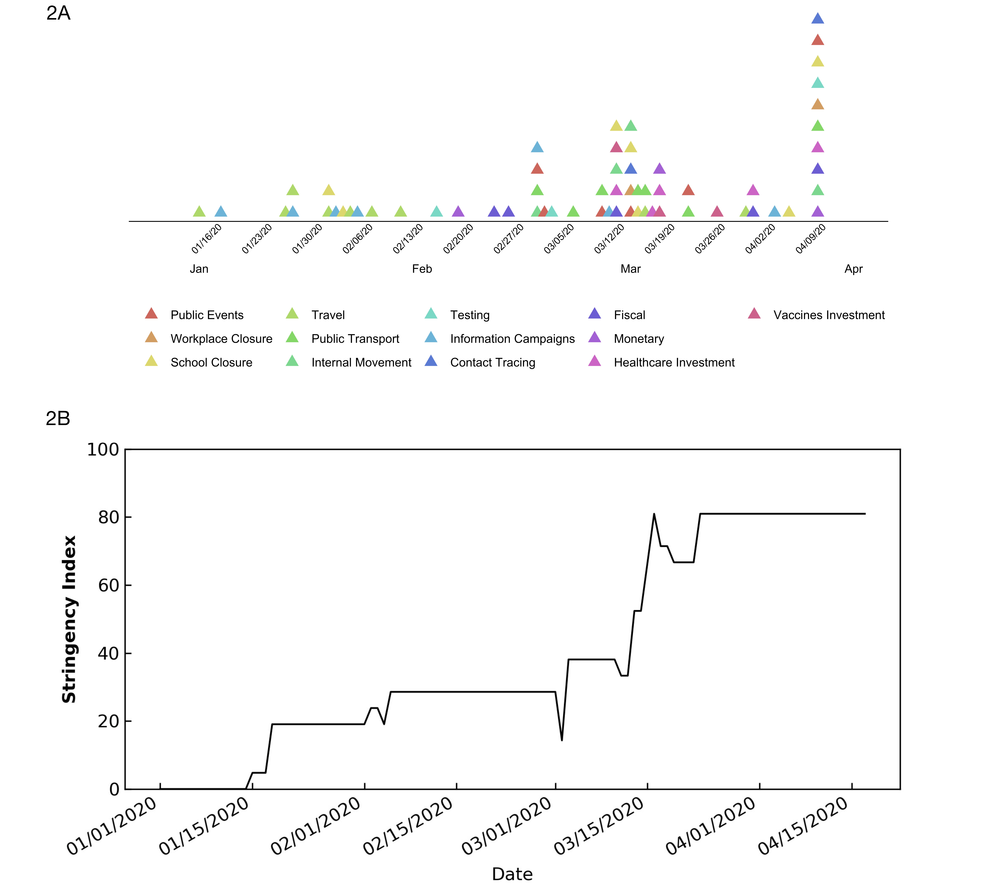
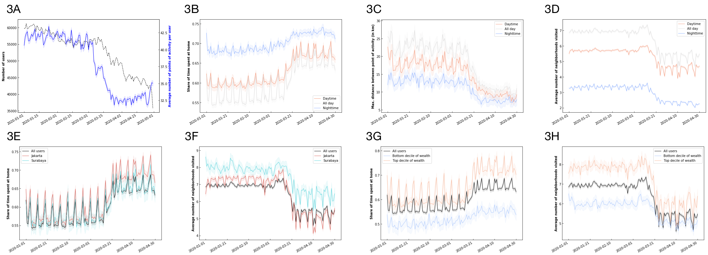
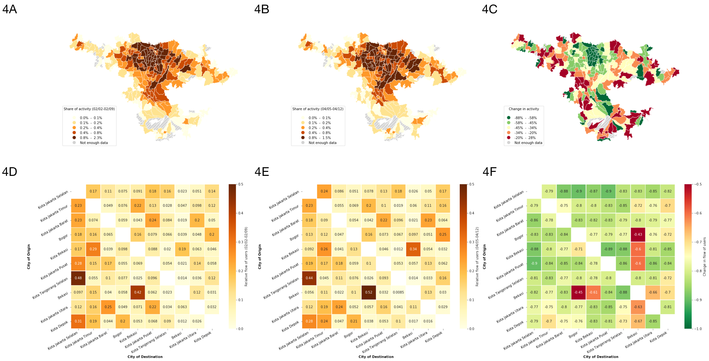
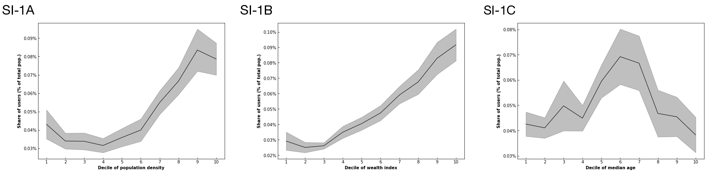
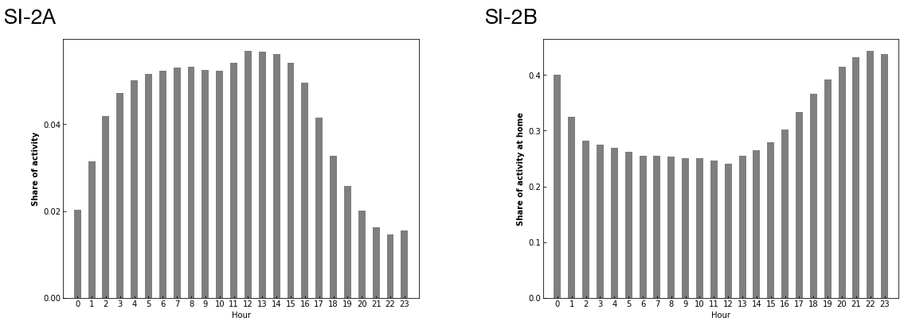

# Report 1 - Quantifying social distancing in Indonesia

Over the past few months, the COVID-19 pandemic has infected millions of people and caused enormous disruptions around the world, pushing healthcare systems to their limits and economies to a halt. Following the guidelines of the WHO, national and local governments worldwide have implemented various social distancing policies ranging from limited curfew hours to strict lockdown, in order to reduce the virus reproduction rate and prevent healthcare systems from being overwhelmed. 

This report aims to quantify the impact on human mobility patterns of social distancing policies implemented in Indonesia. Quantifying human mobility and social distancing is of tremendous importance to scientists and policymakers focusing on mitigating the impact of COVID-19. Researchers and policy analysts in developed countries are now routinely using GPS location data collected from smartphone to quantify human mobility patterns in real-time and high-resolution. Despite the lower coverage offered by these data sources in the developing world, they are nonetheless of tremendous value to help us understand how the current crisis is unraveling.

### 1 - GPS location dataset

Our GPS location data was provided by Cuebiq, a location intelligence company. Cuebiq integrates an SDK into over 220 mobile apps that reach a diverse user base to collect location data at high precision. Their technology continuously collects anonymous location data for users that have opted-in to share their location. Our dataset contains timestamped geolocation data on 276,642 users in Indonesia, representing just under 0.1 percent of the population. Owing to the spatial distribution of cellphone ownership in Indonesia, our GPS data are mostly concentrated in cities (Fig. 1), with 35 percent of users being located in Jakarta, 7 percent in Surabaya, and 5 percent in Bandung (see supplementary information on how we inferred users' home locations).

Fig.1: Number of Cuebiq users whose home location is inferred to be in (A) Indonesia, (B) Jakarta, (C) Surabaya, and (D) Bandung. Number of users are reported relative to the population in the 2010 census, illustrating that the distribution of users is more concentrated in cities. 

### 2 - Social distancing policy measures

With over 12,000 confirmed cases of COVID-19 and close to 900 deaths, Indonesia is seeing one of the world’s highest mortality rates. According to the Coronavirus Government Response Tracker (OxCGRT) published by the Blavatnik School of Government at Oxford University, to date, Indonesia has received a ‘Stringency Index’ of 73.5/100 relative to other countries, characterized by gradual introductions and some withdrawals of policy restrictions [Fig. 2]. The country’s response strategy began with early health checks at the 135 entry points from 14 January, 2020, as well as dissemination of public health information, as visitors continued to be welcomed from Hubei province until 27 January. From 03 February onwards, partial lockdowns ensued, beginning with school closures on Natuna Island (Regency). The border to China was closed on 02 February, followed by expanded restrictions for South Korea, Italy and Iran on 08 February.

The first case was confirmed in Indonesia on 02 March, following which permits for mass gatherings were suspended, and the government started planning to limit the annual Eid al-Fitr exodus across the country, where people typically return to their hometowns. The OxCGRT Stringency Index at this time was 30/100. The President ordered people to stay, work and pray at home on March 15, but national restrictions on movement were not imposed at this time. On 16 March, Jakarta imposed restrictions on the operating hours of public transportation, which were lifted again on 17 March. A state of emergency was declared in Jakarta beginning 23 March, followed by school closures on 7 April. Stringency on incoming foreign nationals continued to increase, with the exception of holders of work permits, diplomats and other officials. The OxCGRT Index climbed to 60/100 at this time. On 14 April, a ban of public gatherings of more than five people was announced in Jakarta, even as, in surrounding areas near Jakarta, new restrictions did not include a ban on domestic travel. Some partial lockdowns were announced in Jakarta’s surrounding areas on 18 April.
Most recently, on 24 April, Indonesia temporarily banned domestic road, air and sea travel as Ramadan commenced for millions of Muslims, after a survey showed many still planned to travel. Troops at checkpoints began to be deployed in the tens of thousands. Private vehicles and motorbikes (but not cargo transportation, ambulances, and fire trucks) were banned from moving in and out of COVID-19 "red zones" –hotspots in major cities.

Fig. 2: (A) Sequence of policy actions taken to mitigate the impact of the COVID-19 pandemic in Indonesia. (B) Strigency index capturing the strength of these policy actions. Source: Oxford COVID-19 Government Response Tracker (OxCGRT).

### 3 - Changes in mobility patterns over time

We now turn to the analysis of the GPS location dataset to quantify the extent to which Indonesians decided to
practice social distancing since the onset of the COVID-19 epidemic. First, we noticed that the number of active users in our sample dropped down sharply from early March [Fig. 3A]: while there were on average 60,000 active users on any given day in January, this number went down to less than 45,000 in April. The average number of GPS locations per user also went down from about 42 in January to about 32 in April. Each user's location is collected so long as she uses smartphone apps authorizing geolocation, hence this drop in activity suggests that smartphone users in Indonesia have started reducing their movements since the first COVID-19 case in the country was recorded. In our next report, we will explore systematic differences between users that remained in the sample and those that dropped out. 

Next, to quantify the mobility patterns of a similar set of people over time, we focused on users who were active on at least half of the days since January 1, 2020, a user being considered active on any given day if her GPS location was observed at least once. This reduced dataset contains 39,108 users. Following the president's order to stay home on March 15, we observed an increase in the amount of time that users spent at home, both during daytime (8am-8pm) and nighttime (8pm-8am), the trend being unsurprisingly shaper for daytime hours [Fig. 3B]. While a user in our sample spent on average 13 hours at home on a typical weekday in January, this number jumped to 15.5 hours on average since March 21st, and has remained stable ever since.

In addition to spending more time at home, Indonesian have reduced the distance that they travel on any given day [Fig. 3C]: while the maximum distance between a user's GPS locations on a typical day in January was close to 25km on average, it dropped to about 8km by the end of April. We also found that the average number of neighborhoods that a user visits went from 7 in January to 5 by the end of April [Fig. 3D]. Surprisingly, prior to going down, the average number of neighborhoods visited by users went up during the first week of March. One possible explanation is that users anticipating a possible lockdown decided to hoard essential goods, leading them to travel to more neighborhoods than usual. Another possibility is that some users decided to move to secondary homes. We will explore these two hypotheses in further details in our next report. 

Although trends in mobility patterns are broadly consistent across cities, we uncovered some interesting geographic variations in mobility patterns [Fig. 3E,F]. First, we noticed a sudden increase in mobility during the Chinese new year on January 25, this pattern being concentrated in Surabaya where the population is predominantly of Chinese origin [Fig. 3F]. We also observed a drop in mobility specifically in Jakarta on February 25 when massive floods struck the city. Furthermore, we found that on average people in Surabaya have reduced their mobility less than people in Jakarta since the onset of the crisis: while the baseline share of time spent at home was about the same between Jakarta and Surabaya, users located in Jakarta have been spending an extra hour at home per day compared to users in Surabaya [Fig. 3E]. Incidentally, there has been an uptick in the number of cases in Surabaya recently, which could be attributed to a lack of effectiveness of social distancing policies. We will explore this further in future work. 

Last but not least, we found that users in the bottom decile of the wealth distribution ("low wealth users") have reduced their mobility much less than users in the top decile ("high wealth users") [Fig. 3G,H]. While the number of hours high wealth users spend at home on a typical weekday went from 14 to 17, that number only increased from 12 to 13 for low wealth users [Fig. 3G]. Furthermore, while high wealth users typically visit, on average, 8 neighborhoods per day compared to 6 for low wealth users, they have been visiting about 5.5 neighborhoods on average in April compared to 5 for low wealth users [Fig. 3H].

Fig. 3: Changes in users mobility patterns over time. (A) Number of active users (black) and average number of GPS locations per user (blue). (B) Share of time users spent at home (black), separating daytime (red) and nighttime (blue). (C) Maximum distance (in km) between a user's GPS locations, averaging across users. (D) Average number of unique neighborhoods visited. Numbers are reported after normalizing by each user's activity over time (see supplementary information for more details). (E,F) We split users based on the metropolitan area in which their home location is located. Then we report mobility patterns in the two metropolitan areas with the highest concentration of users: Jakarta (red) and Surabaya (blue). (G,H) We constructed a wealth index for each level 4 administrative unit in Indonesia using data from the 2010 census. We then split users in deciles based on the average wealth of the administrative unit in which their home location is located. We report mobility patterns for users in the bottom decile ("low wealth users", blue) and top decile ("high wealth users", red). Taken together, these plots show that social distancing policies drastically reduced mobility in Indonesia, primarily for the most wealthiest portion of the population.

### 4 - Changes in mobility patterns across space

Next, we show how smartphone location data can help uncover variations in human mobility within a metropolitan area. This is informative both to identify areas of high activity as well as flows of people between different areas, allowing us to quantify the effectiveness of social distancing policies, and underscore potential strategies to improve them. 

In what follows, we restrict our analysis to the Jakarta metropolitan area [Fig. 4]. First, we find that the center of the city where most of human activity is concentrated has witnessed the highest drop in activity outside users’ home locations, reaching almost 90 percent reduction in some neighborhoods [Fig. 4C]. Interestingly, a few neighborhoods in the periphery of the city saw an increase in activity outside users’ home locations. This increase in activity presumably corresponds to users spending time at residential neighborhoods close to where they live. We will investigate this finding further in our next report. Furthermore, by uncovering the flow of people between cities within the metropolitan areas, we can pinpoint where users leaving a hotspot are the most likely to travel, and where the municipality could allocate resources to reduce population mixing [Fig. 4F].

Fig. 4: Change in mobility within the Jakarta metropolitan area. (A, B, C) Number of GPS locations observed outside of users' home locations across each level 3 administrative unit within the Jakarta metropolitan area. We report the activity (A) during the first week of February, (B) during the first week of April, and (C) the change in activity between these two periods. (D,E,F) Origin destination matrix showing the flow of users between cities within Jakarta metropolitan area during (D) the first week of February, (E) the first week of April, and (F) the change in flows between these two periods. 

### 5 - Discussion

This report illustrates that GPS location data provide key insights into mobility changes in Indonesia resulting from social distancing policies. It's important to keep in mind that this data only covers a small fraction of the population and is biased in various ways (Fig. SI-1). More analysis needs is warranted to correct for some of these biases and test the validity of some of our findings using additional data sources. In addition, we are expanding this analysis to other countries where similar data is available, seeking to provide such information to policymakers using interactive visualization tools in a way that is easy to interpret.

### Supplementary information

