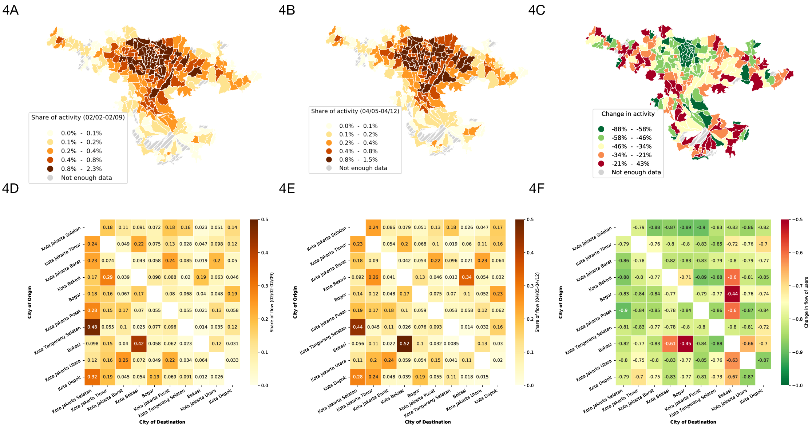

<h1>
 Quantifying human mobility and social distancing with GPS location data
</h1>
<h4>
Report #1 (Latest update: 5/11/2020)
</h4>

 
Samuel P. Fraiberger* (World Bank, MIT, New-York University) 
Pablo Astudillo (World Bank, Oxford University) 
Alex Chunet (World Bank)  
Lorenzo Camargo (World Bank, Fondazione Bruno Kessler)  
Nicholas Jones (World Bank)  
Maham Kahn (World Bank)  
Nancy Lozano Gracia (World Bank)  
Emanuele Massaro (World Bank, Ecole polytechnique fédérale de Lausanne)  
Aleister Montfort (World Bank)

 
We document how anomymized smartphone location data allows to quantify the impact on human mobility patterns of social distancing policies implemented to mitigate the spread of the COVID-19 pandemic. Focusing on the case of Indonesia, we found that following the president's order to stay home on March 15, human mobility was substantially reduced and has remained stable ever since: on average, the share of users' time spent at home increased by 15%, while the number of neighborhoods that they visit and the maximum distance they travel on any given day decreased by 25% and 50% respectively. However, everyone is not practicing social distancing in the same proportion: on average, users in the top decile of the wealth distribution have reduced their mobility between 50% and 100% more than those in the bottom decile. Furthermore, we also found that users located in Surabaya have reduced their mobility between 33% and 50% more than those located in Jakarta. These findings highlight that GPS location data allow to shed light on changes in mobility patterns even in a middle-income country in which coverage is relatively low, providing an instrument to policymakers aiming to efficienty allocate resources to reduce the virus reproduction rate.

### 1 - Introduction

 
Over the past few months, the COVID-19 pandemic has infected millions of people and caused enormous disruptions around the world, pushing healthcare systems to their limits and economies to a halt. Following the guidelines of the WHO, national and local governments worldwide have implemented various social distancing policies ranging from limited curfew hours to strict lockdown, in order to reduce the virus reproduction rate and prevent healthcare systems from being overwhelmed.

 
This report aims to quantify the impact on human mobility patterns of social distancing policies implemented in Indonesia. Quantifying human mobility and the extent to which social distancing practices have been put in place, is of tremendous importance to scientists and policymakers focusing on mitigating the impact of COVID-19. Researchers and policy analysts in developed countries are now routinely using GPS location data collected from smartphone to quantify human mobility patterns in real-time and with high-resolution. Despite the lower coverage offered by these data sources in the developing world, they are nonetheless of tremendous value to improve the understanding of how the current crisis is unraveling.

### 2 - Data

 
Our anonymized GPS location data was provided by Cuebiq, a location intelligence company. Cuebiq integrates an SDK into over 86 mobile apps that reach a diverse user base to collect location data at high precision. Their technology continuously collects anonymous location data from users that have opted-in to share their location through a GDPR compliant framework. Our dataset contains timestamped geolocation data on 276,642 users in Indonesia, representing just under 0.1 percent of the population. Owing to the spatial distribution of cellphone ownership in Indonesia, our GPS data are mostly concentrated in cities (Fig. 1), with 35 percent of users being located in Jakarta and 7 percent in Surabaya (see supplementary information on how we inferred users' home locations).

Fig.1: Number of Cuebiq users whose home location is inferred to be in (A) Indonesia, (B) Jakarta, and (C) Surabaya. Number of users are reported relative to the population in the 2010 census, illustrating that the distribution of users is more concentrated in cities.

### 2 - Social distancing policy measures

 
By May 11, Indonesia already had over 14,000 confirmed cases of COVID-19 and close to 1,000 deaths. According to the Coronavirus Government Response Tracker (OxCGRT) published by the Blavatnik School of Government at Oxford University, to date, Indonesia has received a ‘Stringency Index’ of 73.5/100 relative to other countries, characterized by gradual introductions and some withdrawals of policy restrictions [Fig. 2]. The country’s response strategy began with early health checks at the 135 entry points from 14 January, 2020, as well as dissemination of public health information, as visitors continued to be welcomed from Hubei province until 27 January. From 03 February onwards, partial lockdowns ensued, beginning with school closures on Natuna Island (Regency). The border to China was closed on 02 February, followed by expanded restrictions for South Korea, Italy and Iran on 08 February.

 
The first case was confirmed in Indonesia on 02 March, following which permits for mass gatherings were suspended, and the government started planning to limit the annual Eid al-Fitr exodus across the country, where people typically return to their hometowns. The OxCGRT Stringency Index at this time was 30/100. The President ordered people to stay, work and pray at home on March 15, but national restrictions on movement were not imposed at this time. On 16 March, Jakarta imposed restrictions on the operating hours of public transportation, which were lifted again on 17 March. A state of emergency was declared in Jakarta beginning 23 March, followed by school closures on 7 April. Stringency on incoming foreign nationals continued to increase, with the exception of holders of work permits, diplomats and other officials. The OxCGRT Index climbed to 60/100 at this time. On 14 April, a ban of public gatherings of more than five people was announced in Jakarta, even as, in surrounding areas near Jakarta, new restrictions did not include a ban on domestic travel. Some partial lockdowns were announced in Jakarta’s surrounding areas on 18 April. Most recently, on 24 April, Indonesia temporarily banned domestic road, air and sea travel as Ramadan commenced for millions of Muslims, after a survey showed many still planned to travel. Troops at checkpoints began to be deployed in the tens of thousands. Private vehicles and motorbikes (but not cargo transportation, ambulances, and fire trucks) were banned from moving in and out of COVID-19 "red zones" –hotspots in major cities.

Fig. 2: Sequence of policy actions taken to mitigate the impact of the COVID-19 pandemic in Indonesia, the strigency index capturing the strength of these policy actions. Source: Oxford COVID-19 Government Response Tracker (OxCGRT).

### 3 - Changes in mobility patterns over time

 
We now turn to the analysis of the GPS location dataset to quantify the extent to which Indonesians decided to practice social distancing since the onset of the COVID-19 epidemic. First, we noticed that the number of active users in our sample dropped down sharply from early March [Fig. 3A]: while there were on average 60,000 active users on any given day in January, this number went down to less than 45,000 in April. The daily average number of GPS locations per user also went down from about 42 in January to about 32 in April. Each anonymous user's location is collected so long as she uses smartphone apps authorizing geolocation, hence this drop in activity suggests that smartphone users in Indonesia have started reducing their movements since the first COVID-19 case in the country was recorded. In our next report, we will explore systematic differences between users that remained in the sample and those that dropped out.

 
Next, to quantify the mobility patterns of a similar set of people over time, we focused on users who were active on at least half of the days since January 1, 2020; a user is considered active on any given day if her GPS location was observed at least once. This reduced dataset contains 39,108 users. Following the president's order to stay home on March 15, we observed an increase in the amount of time that users spent at home, both during daytime (8am-8pm) and nighttime (8pm-8am), the trend being unsurprisingly shaper for daytime hours [Fig. 3B]. While a user in our sample spent on average 13 hours at home on a typical weekday in January, this number jumped to 15.5 hours on average since March 21st, and has remained stable ever since.

 
In addition to spending more time at home, Indonesians have reduced the distance that they travel on any given day [Fig. 3C]: while the maximum distance between a user's GPS locations on a typical day in January was close to 25km on average, it dropped to about 8km by the end of April. We also found that the average number of neighborhoods that a user visits went from 7 in January to 5 by the end of April [Fig. 3D]. Surprisingly, prior to the March 15 order, the average number of neighborhoods visited by users increased during the first week of March. One possible explanation is that users anticipating a possible lockdown decided shop essential goods or run other errands, leading them to travel to more neighborhoods than usual. Another possibility is that some users decided to move to secondary homes. We will explore these two hypotheses in further details in our next report.

 
Although trends in mobility patterns are broadly consistent across cities, we uncovered some interesting geographic variations in mobility patterns [Fig. 3E,F]. First, we noticed a sudden increase in mobility during the Chinese new year on January 25, this pattern being concentrated in Surabaya where the population is predominantly of Chinese origin [Fig. 3F]. We also observed a drop in mobility specifically in Jakarta on February 25 when massive floods struck the city. Furthermore, we found that on average people in Surabaya have reduced their mobility less than people in Jakarta since the onset of the crisis: users located in Surabaya have increased their time spent at home by 15% whereas for those located in Jakarta that number increased by 20%, leading to an extra hour spent at home per day for users Jakarta compared to those in Surabaya [Fig. 3E]. Incidentally, there has been an uptick in the number of cases in Surabaya recently, which could be attributed to a lack of effectiveness of social distancing policies. We will explore this further in future work.

 
Last but not least, we found that users in the bottom decile of the wealth distribution ("low-wealth users") have reduced their mobility much less than users in the top decile ("high-wealth users") [Fig. 3G,H]. While low-wealth users increased the time they spend at home by 11%, high-wealth users have increased it by 20% [Fig. 3G]. Furthermore, low wealth users only reduced the number of neighborhoods visited per day by 17% wherease high wealth users reduced it by 25% [Fig. 3H].

 
Fig. 3: Changes in users mobility patterns over time. (A) Number of active users (black) and average number of GPS locations per user (blue). (B) Share of time users spent at home (black), separating daytime (red) and nighttime (blue). (C) Maximum distance (in km) between a user's GPS locations, averaging across users. (D) Average number of unique neighborhoods visited. Numbers are reported after normalizing by each user's activity over time (see supplementary information for more details). (E,F) We split users based on the metropolitan area in which their home location is located. We then compute changes in mobility relative to the average mobility level during the month of January, and we report mobility changes in the two metropolitan areas with the highest concentration of users: Jakarta (red) and Surabaya (blue). (G,H) We constructed a wealth index for each level-4 administrative unit in Indonesia using data from the 2010 census. We then split users in deciles based on the average wealth of the administrative unit in which their home location is located. We then computed changes in mobility relative to the average mobility level during the month of January, and we report changes in mobility patterns for users in the bottom decile ("low-wealth users", blue) and top decile ("high-wealth users", red). Taken together, these plots show that social distancing policies substancially reduced mobility in Indonesia, primarily for the most wealthiest portion of the population.

 

### 4 - Changes in mobility patterns across space

Next, we show how smartphone location data can help uncover variations in human mobility within a metropolitan area. This is informative both to identify areas of high activity as well as flows of people between different areas, allowing us to quantify the effectiveness of social distancing policies, and underscore potential strategies to improve them.

In what follows, we restrict our analysis to the Jakarta metropolitan area [Fig. 4]. First, we find that the center of the city has witnessed the highest drop in activity outside users’ home locations, reaching more than 90 percent reduction in some neighborhoods [Fig. 4C]. Interestingly, a few neighborhoods in the periphery of the city saw an increase in activity outside users’ home locations. This increase in activity presumably corresponds to users spending time at residential neighborhoods close to where they live. We will investigate this finding further in our next report. Furthermore, by uncovering the flow of people between areas within the metropolitan region, we can pinpoint where users living in a hotspot are the most likely to travel, and where policy makers could allocate resources to reduce population mixing [Fig. 4F]. For example, targeted communication campaigns at key origins can help reduce the size of flows. Further understanding of the reasons for the persisting flows can hint at possibilities for flow management to minimize risks.

 

Fig. 4: Change in mobility within the Jakarta metropolitan area. (A, B, C) Number of GPS locations observed outside of users' home locations across each level 3 administrative unit within the Jakarta metropolitan area. We report the activity (A) during the first week of February, (B) during the first week of April, and (C) the change in activity between these two periods. (D,E,F) Origin-destination matrix showing the flow of users between cities within Jakarta metropolitan area during (D) the first week of February, (E) the first week of April, and (F) the change in flows between these two periods.

### 5 - Discussion

 
Using Indonesia as an example, this report illustrates that anonymous GPS location data can provide key insights into mobility changes within and around cities in the developing world, resulting from social distancing policies. It is important to keep in mind that these data only covers a small fraction of the population and can be biased in various ways (Fig. SI-1). More analysis is warranted to better understand and correct for some of these biases and test the validity of some of our findings using additional data sources. This work is also being expanded to other countries where similar data is available. We are also developing a dashboard to present the results of this work to policymakers using interactive visualization tools in a way that is easy to interpret.

 

### Supplementary information

[TO BE COMPLETED]

In order to preserve privacy, the data provider up-levels home locations to a geohash grid, thereby allowing demographic analysis based on residential areas without revealing the precise home location of anonymized users. 

